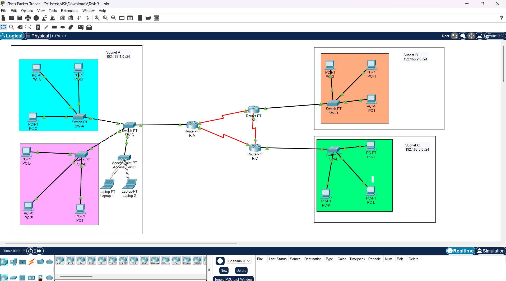
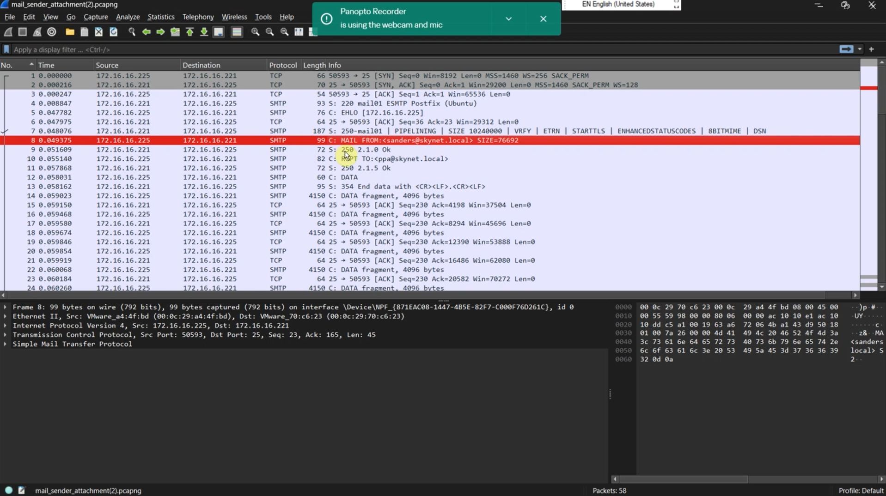
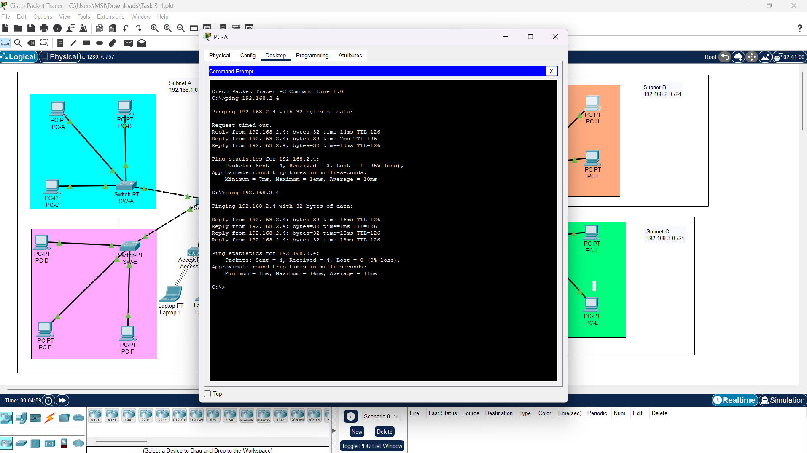

# Enterprise Network Architecture & Protocol Analysis

## Project Overview
This project involves the end-to-end design, implementation, and security analysis of a multi-subnet enterprise network. The project progresses through three distinct phases: Analyzing application-layer vulnerabilities in email protocols, establishing resilient dynamic routing (OSPF), and implementing Layer 2/3 security via VLAN segmentation and Inter-VLAN routing.

## Phase 1: SMTP Protocol Analysis (Video Walkthrough)
In this phase, I conducted a deep-packet inspection of the Simple Mail Transfer Protocol (SMTP). I analyzed the handshake process and identified critical security flaws regarding data exposure in cleartext.

* [▶️ Watch SMTP Protocol Analysis](https://youtu.be/PHX6I33nsko)

## Tools & Technologies
* **Cisco Packet Tracer:** For logical topology design and network simulation.
* **Wireshark:** For deep packet inspection (DPI) and frame-level analysis.
* **Routing & Switching:** OSPF (Dynamic Routing), VLANs, Router-on-a-Stick (Inter-VLAN).
* **Protocols:** SMTP, TCP, ICMP, IP.

## Technical Implementation

### Phase 2: Dynamic Routing (OSPF)
Developed a multi-router backbone using **Open Shortest Path First (OSPF)**. This configuration ensures the network is self-healing and can dynamically recalculate routing paths in the event of a link failure.

### Phase 3: Network Segmentation (VLANs)
To improve the security posture, I implemented **Virtual LANs (VLANs)** to segment the network into functional departments (HR, IT, Finance). This prevents unauthorized lateral movement while allowing controlled communication via a **Router-on-a-Stick** configuration.

## Technical Evidence

### Evidence 1: Enterprise Network Topology

*Comment: The completed Task 3 architecture in Cisco Packet Tracer. This diagram displays the full OSPF backbone and the segmented department LANs with assigned VLAN IDs.*

### Evidence 2: OSPF Routing Table Convergence

*Comment: CLI output from a core router showing the OSPF routing table. The 'O' indicator confirms that routes were dynamically learned, ensuring high availability across the enterprise.*

### Evidence 3: Wireshark Packet Analysis (SMTP)

*Comment: A frame-level view of the SMTP communication. The capture identifies cleartext commands (HELO, MAIL FROM), highlighting a vulnerability to credential sniffing and data interception.*

### Evidence 4: Inter-VLAN Connectivity Verification

*Comment: Successful ICMP echo requests between different subnets. This verifies that Inter-VLAN routing and OSPF convergence are functioning correctly, allowing authorized cross-departmental communication.*

## Key Insights & Recommendations
* **Vulnerability:** SMTP analysis revealed that without TLS/SSL, user data is fully exposed on the network.
* **Optimization:** Proposed the implementation of **Access Control Lists (ACLs)** on the VLAN gateways to enforce the Principle of Least Privilege (PoLP).
* **Resilience:** Verified that OSPF successfully redirected traffic during a simulated primary link failure.
